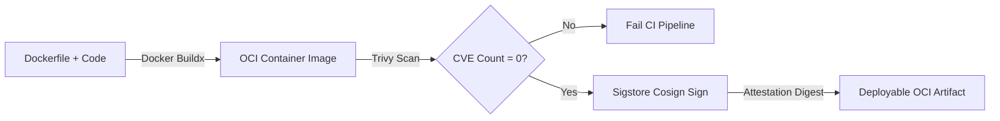

# Hardened OCI Packaging & Cosign Supply Chain

To prevent supply chain poisoning and ensure binary provenance in air-gapped classified clusters, all platform CLI binaries (`delivery-cli` and `lease-pruner`) are packaged into hardened, rootless distroless containers.

---

## Multi-Stage Rootless Dockerfile Specification

```dockerfile
# Multi-stage, rootless, distroless container image for Federal Delivery CLI
# Aligned with DoD Platform One / Chainguard hardened Python baseline

# Build stage
FROM cgr.dev/chainguard/python:latest-dev AS builder
WORKDIR /app
COPY requirements.txt .
RUN pip install --no-cache-dir --user -r requirements.txt

# Final production runtime (Distroless / Non-root 65532)
FROM cgr.dev/chainguard/python:latest
WORKDIR /app
COPY --from=builder /home/nonroot/.local /home/nonroot/.local
COPY delivery_cli.py /app/delivery_cli.py

USER 65532:65532
ENV PATH="/home/nonroot/.local/bin:$PATH"
ENV PYTHONUNBUFFERED=1

ENTRYPOINT ["python", "/app/delivery_cli.py"]
CMD ["--help"]
```

---

## CI Build, Vulnerability Scan & Cryptographic Attestation

The pipeline executes automatically on pull request and release tags:


