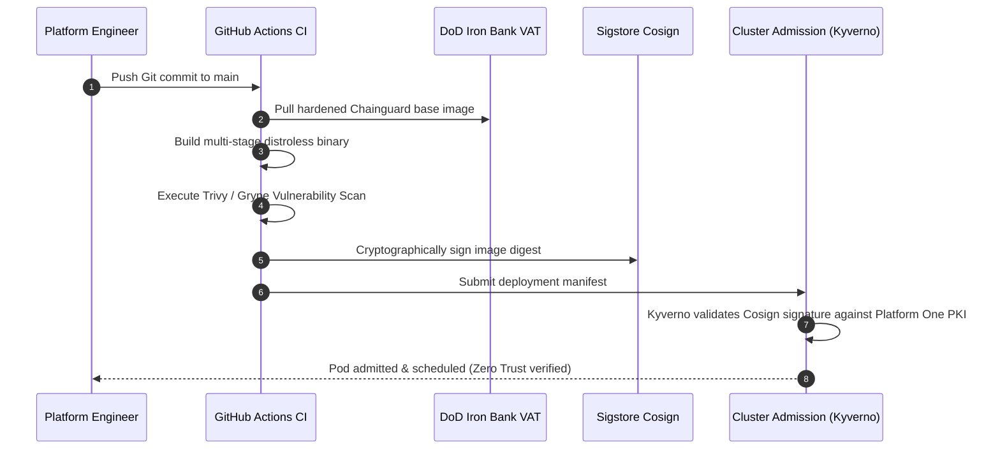

# Multi-Site Governance & DoD Iron Bank Compliance

All container workloads across the 50 clusters operate under strict DoD Platform One STIG (Security Technical Implementation Guide) baselines enforced at admission time via Kyverno and Gatekeeper.

---

## Iron Bank Admission Control Policies

ワークロード specifications must adhere to `security/kyverno/dod-ironbank-baseline.yaml`. Any pod manifest violating these requirements is rejected at the API server admission webhook stage:

```yaml
apiVersion: kyverno.io/v1
kind: ClusterPolicy
metadata:
  name: dod-ironbank-baseline
spec:
  validationFailureAction: Enforce
  background: true
  rules:
    - name: require-run-as-non-root
      match:
        any:
          - resources:
              kinds: ["Pod"]
      validate:
        message: "STIG V-242415: Containers must run as non-root (runAsNonRoot: true)."
        pattern:
          spec:
            securityContext:
              runAsNonRoot: true

    - name: require-read-only-rootfs
      match:
        any:
          - resources:
              kinds: ["Pod"]
      validate:
        message: "STIG V-242417: Container root filesystem must be read-only."
        pattern:
          spec:
            containers:
              - securityContext:
                  readOnlyRootFilesystem: true
```

---

## Supply Chain Integrity & Attestation Flow


