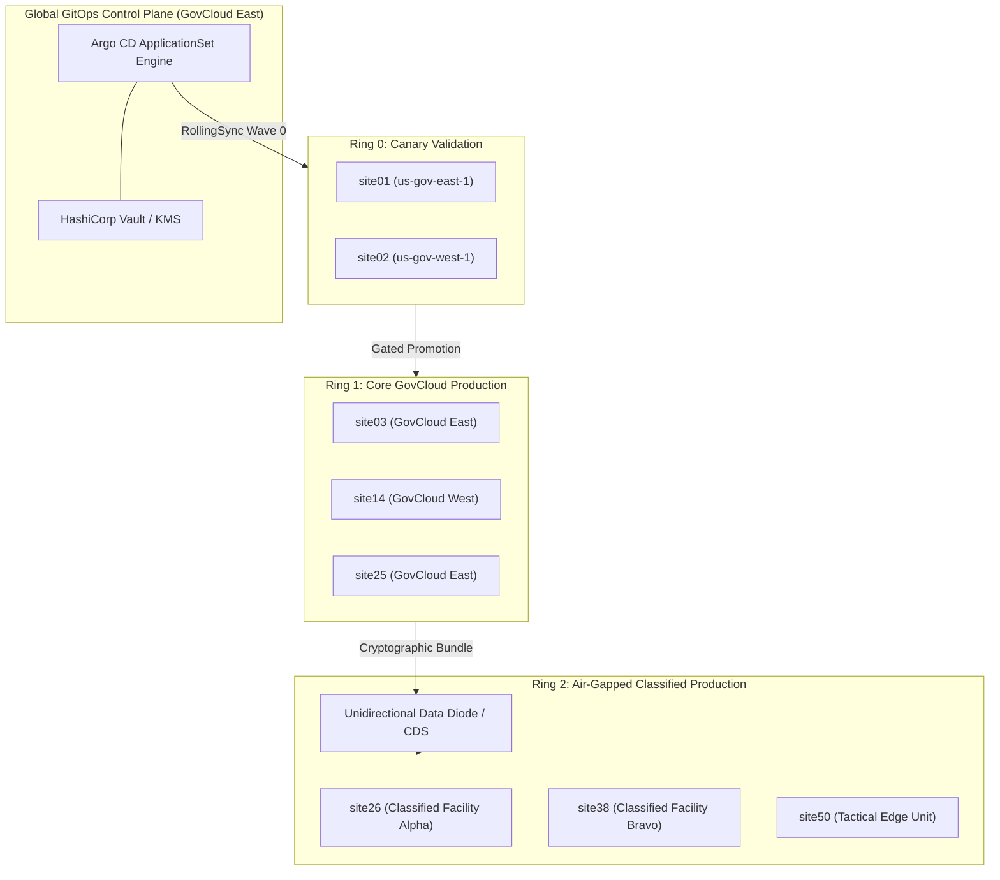

# Fleet Architecture & Deployment Topology

The enterprise lakehouse substrate is deployed across **50 production Kubernetes clusters** partitioned into three operational deployment rings. This topology guarantees that untested regressions, storage class driver locks, or network overlay misconfigurations are trapped before reaching classified enclaves.

---

## Multi-Ring Topology Matrix

| Ring Identifier | Scope & Classification | Cluster Count | Target Clusters | Ingress / Transit Topology | Rollout Strategy |
|:---|:---|:---|:---|:---|:---|
| **Ring 0 (Canary)** | Synthetic Pre-Flight & Integration | 2 Clusters | `site01` - `site02` | Direct API Gateway / Public Staging | 100% concurrent; automated synthetic gating |
| **Ring 1 (Core GovCloud)** | Multi-Tenant Unclassified GovCloud | 23 Clusters | `site03` - `site25` | AWS GovCloud Multi-AZ Transit Gateway | Staged rolling waves (25% batch size) |
| **Ring 2 (Classified)** | Air-Gapped Sovereign Defense Enclaves | 25 Clusters | `site26` - `site50` | Unidirectional Optical Data Diode | Offline release bundle with Harbor mirroring |

---

## Topology Architecture Diagram

---

## Cluster Hardware & Infrastructure Specifications

Each cluster node pool is provisioned to support extreme analytical throughput:
* **Compute Workers (Trino & Spark)**: 16 vCPU, 64 GiB RAM, with 2x 1.92TB direct-attached NVMe PCIe SSDs striped in RAID0 for query spill partitions (`/mnt/nvme-spill`).
* **Storage Brokers (Strimzi Kafka)**: Dedicated 3-broker StatefulSet with 10Gbps provisioned network interfaces and high-IOPS persistent volumes.
* **Control Plane Nodes**: 3-node HA control plane running etcd with SSD write latencies strictly guaranteed `< 10ms`.
