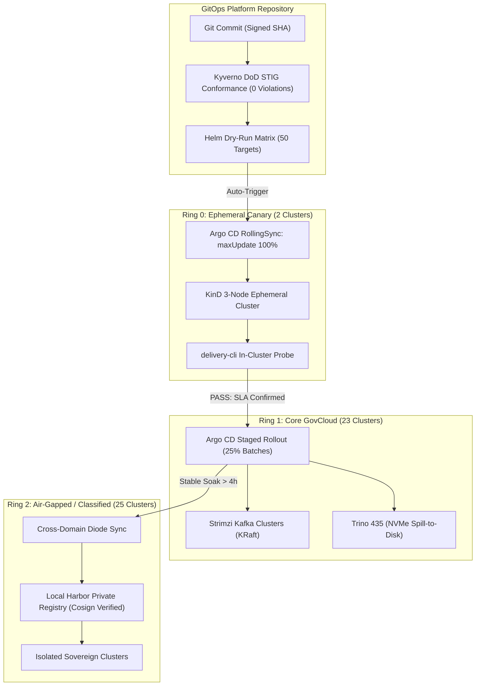

# Multi-Site Kubernetes Delivery Specification & Fleet Operations

<div style="display: flex; gap: 8px; flex-wrap: wrap; margin-bottom: 16px;">
  <a href="https://github.com/FreeFades2Black/fleet-lakehouse-operator/actions/workflows/e2e-canary.yml"></a>
  <a href="https://github.com/FreeFades2Black/fleet-lakehouse-operator/blob/main/security/kyverno/dod-ironbank-baseline.yaml"></a>
  <a href="https://github.com/FreeFades2Black/fleet-lakehouse-operator/actions/workflows/package-oci.yml"></a>
  <a href="https://github.com/FreeFades2Black/platform-resilience-fieldguide/actions/workflows/package-oci.yml"></a>
  <a href="https://github.com/FreeFades2Black/enterprise-platform-portal/actions/workflows/deploy-portal.yml"></a>
  <a href="https://github.com/FreeFades2Black/platform-flight-simulator"></a>
</div>

Delivery specification, fleet topology, and incident triage catalog for multi-site Kubernetes deployments running the Lakehouse substrate (Strimzi Kafka, Trino, Iceberg). Covers staged Argo CD rollout rings, Iron Bank policy baselines, and post-mortem analyses from field triage.

---

## Production Artifacts & Manifest Index

| Subsystem | Verified Production Manifest | Scope & Implementation | Verification Target |
|:---|:---|:---|:---|
| **Digital Twin Sandbox** | [`FreeFades2Black/platform-flight-simulator`](https://github.com/FreeFades2Black/platform-flight-simulator) | Interactive React Flow sandbox with packet physics, virtual terminal, & deep inspector | [Interactive Flight Simulator](https://github.com/FreeFades2Black/platform-flight-simulator) |
| **Fleet GitOps Engine** | [`argocd/applicationset-fleet-matrix.yaml`](https://github.com/FreeFades2Black/fleet-lakehouse-operator/blob/main/argocd/applicationset-fleet-matrix.yaml) | ApplicationSet with `RollingSync` across 3 deployment rings | [Rollout Specification](fleet-gitops/rollouts.md) |
| **Lakehouse Substrate** | [`helm/lakehouse-substrate/`](https://github.com/FreeFades2Black/fleet-lakehouse-operator/tree/main/helm/lakehouse-substrate) | Strimzi Kafka 3.7.0, Trino 435 (NVMe spill), Nessie catalog | [Substrate Architecture](fleet-gitops/substrate.md) |
| **DoD Policy Baseline** | [`security/kyverno/dod-ironbank-baseline.yaml`](https://github.com/FreeFades2Black/fleet-lakehouse-operator/blob/main/security/kyverno/dod-ironbank-baseline.yaml) | Enforces `runAsNonRoot`, `readOnlyRootFilesystem`, capability drops | [Compliance Spec](fleet-overview/compliance.md) |
| **Canary E2E Test Suite** | [`tests/test_fleet_orchestration.py`](https://github.com/FreeFades2Black/fleet-lakehouse-operator/blob/main/tests/test_fleet_orchestration.py) | 3-node KinD topology with zoned storage & synthetic query probes | [Canary Gate Workflow](fleet-gitops/canary-gate.md) |
| **Field SRE Runbooks** | [`operations/runbooks/`](https://github.com/FreeFades2Black/platform-resilience-fieldguide/tree/main/operations/runbooks) | Deterministic triage for CSI locks, etcd defrag, admission timeouts | [Triage Runbooks](resilience-vault/runbooks.md) |
| **Automated Remediation** | [`scripts/remediation/lease_pruner.py`](https://github.com/FreeFades2Black/platform-resilience-fieldguide/blob/main/scripts/remediation/lease_pruner.py) | Active lease breaker resolving split-brain controller leader elections | [Field Post-Mortems](resilience-vault/incident-rcas.md) |

---

## Active Fleet Rollout & Live Telemetry

Production fleets operating across distributed and air-gapped enclaves do not maintain static 100% reconciliation at all times. Below is the operational snapshot of active deployment waves, in-flight container image preloading, and active automated remediation:

<div style="background: #161b22; border: 1px solid #30363d; border-radius: 8px; padding: 14px 18px; margin-bottom: 18px; font-family: monospace; font-size: 0.88rem;">
  <span style="color: #8b949e;">Active Promotion Wave:</span> <strong style="color: #00e5ff;">Wave 2 In-Progress (v1.4.1 &rarr; v1.4.2)</strong><br/>
  <span style="color: #8b949e;">Fleet Distribution:</span> <strong style="color: #3fb950;">44 Synced (88%)</strong> &bull; <strong style="color: #d29922;">4 Progressing (8%)</strong> &bull; <strong style="color: #f85149;">2 In Active Triage (4%)</strong>
</div>

| Cluster Identifier | Deployment Ring & Location | Workload Engine Target | GitOps Sync State | Telemetry / P99 | Operational Health & Handled Triage |
|:---|:---|:---|:---|:---|:---|
| `site-01` | **Ring 0 (Canary)**<br/>`us-gov-east-1a` | Trino Coordinator + Kafka | <span class="mission-control-badge badge-green">Synced (v1.4.2)</span> | **12ms** API<br/>0.72s Query | KinD ephemeral gate validated; zero policy violations. |
| `site-14` | **Ring 1 (GovCloud)**<br/>`us-gov-west-1b` | 3-Broker Strimzi Kafka | <span class="mission-control-badge badge-green">Synced (v1.4.2)</span> | **44ms** API<br/>1.05s Query | Wave 1 rollout healthy; NVMe spill volume at 24% capacity. |
| `site-28` | **Ring 2 (Air-Gap)**<br/>`Enclave Alpha (Classified)` | Lakehouse Storage Pods | <span class="mission-control-badge badge-yellow">Progressing (v1.4.1 &rarr; v1.4.2)</span> | Diode Synced | Image preload 82% (harbor registry OCI bundle replication). |
| `site-41` | **Ring 1 (Edge)**<br/>`Tactical Hub Echo` | Trino Worker Ingestion | <span class="mission-control-badge badge-red">Sync Failed</span> | Degraded (140ms) | Admission controller webhook timeout &rarr; **[Runbook 04 Engaged](resilience-vault/runbooks.md#rb-04-admission-controller-webhook-timeout-recovery)** |
| `site-48` | **Ring 2 (Air-Gap)**<br/>`Enclave Bravo (Classified)` | Strimzi Persistent Volumes | <span class="mission-control-badge badge-yellow">Degraded</span> | I/O Throttled | Stale `VolumeAttachment` lock &rarr; **[Runbook 01 Automated Pruner](resilience-vault/runbooks.md#rb-01-stale-csi-volumeattachment-recovery)** |

---

## Fleet Promotion & Staged Wave Topology

Every release progresses through an automated delivery pipeline governed by Argo CD `ApplicationSet` matrix generators, ephemeral KinD validation, and soak gates:



---

## Platform Architecture Model

This portal integrates the two pillars required for multi-site Kubernetes platform operations:

```
+----------------------------------------------------------------------------------------------------+
|                         ENTERPRISE PLATFORM DELIVERY & RELIABILITY PORTAL                          |
+----------------------------------------------------------------------------------------------------+
|                                                                                                    |
|   PILLAR 1: Fleet GitOps & Delivery Engine          PILLAR 2: Field SRE & Resilience Vault        |
|   ├── Argo CD ApplicationSet Matrix Generator       ├── Real Post-Mortems with Raw Terminal Logs    |
|   ├── Lakehouse Helm Substrate (Kafka, Trino)       ├── Deterministic Triage Runbooks              |
|   ├── Ephemeral Canary CI/CD Gating (KinD)          ├── Golden Signals as Code (PrometheusRule)    |
|   └── Distroless OCI Packaging & Cosign Supply Chain└── Automated Remediation Scripts (lease-pruner)|
|                                                                                                    |
+----------------------------------------------------------------------------------------------------+
```

### Direct Navigation

* **[Architecture & Deployment Topology](fleet-overview/topology.md)**: Cluster grouping, hardware node pools, and network routing specifications.
* **[Argo CD ApplicationSet Matrix](fleet-gitops/rollouts.md)**: RollingSync wave promotion strategy, cluster inventory, and progressive delivery.
* **[Lakehouse Substrate Architecture](fleet-gitops/substrate.md)**: Strimzi Kafka, Trino 435 with NVMe spill-to-disk, and Iceberg catalog configuration.
* **[Canary CI/CD Gating](fleet-gitops/canary-gate.md)**: Ephemeral KinD pre-flight spin-up, synthetic validation probes, and automated failure injection.
* **[Incident Post-Mortems & RCAs](resilience-vault/incident-rcas.md)**: Real post-mortems with unfiltered terminal traces, eBPF captures, and root causes.
* **[Deterministic Triage Runbooks](resilience-vault/runbooks.md)**: Step-by-step resolution playbooks with exact kubectl, crictl, and remediation CLI commands.
* **[Interactive Fleet Status Matrix](interactive-matrix/fleet-matrix.md)**: Comprehensive 50-cluster operational breakdown across all three rings.
