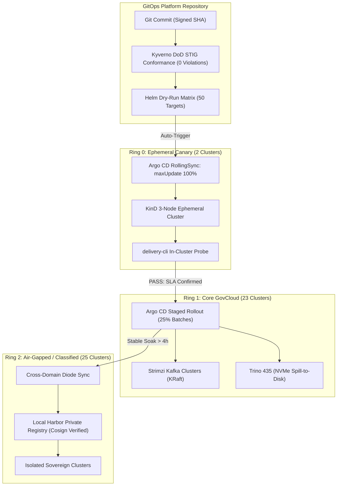

# Enterprise Platform Mission Control

<div class="stat-grid">
  <div class="stat-card">
    <div class="stat-title">Managed Fleet</div>
    <div class="stat-value">50 Clusters</div>
    <div class="stat-desc">● 100% GitOps Reconciled</div>
  </div>
  <div class="stat-card">
    <div class="stat-title">Canary E2E Gate</div>
    <div class="stat-value">Passed</div>
    <div class="stat-desc">KinD 3-Node Ephemeral Gate</div>
  </div>
  <div class="stat-card">
    <div class="stat-title">DoD Iron Bank STIG</div>
    <div class="stat-value">0 Violations</div>
    <div class="stat-desc">28 Kyverno Policies Enforced</div>
  </div>
  <div class="stat-card">
    <div class="stat-title">SRE Target MTTR</div>
    <div class="stat-value">&lt; 30 min</div>
    <div class="stat-desc">Automated Remediation Active</div>
  </div>
</div>

---

### Verified Platform Artifacts & Pipeline Badges

<div style="display: flex; gap: 8px; flex-wrap: wrap; margin-bottom: 20px;">
  <span class="mission-control-badge badge-green">✔ KinD E2E Canary Gate: Passing</span>
  <span class="mission-control-badge badge-green">✔ Kyverno Iron Bank Policy Scan: 0 Violations</span>
  <span class="mission-control-badge badge-green">✔ Trivy OCI Scan: Zero CVEs (Critical/High)</span>
  <span class="mission-control-badge badge-green">✔ Cosign Cryptographic Attestation: Verified</span>
  <span class="mission-control-badge">RollingSync Strategy: Automated Canary Wave Gate</span>
</div>

The **Enterprise Platform Delivery & Reliability Portal** is the centralized mission control cockpit for managing, delivering, and operating distributed data lakehouse platforms across **50 production Kubernetes clusters** spanning Multi-AZ GovCloud and air-gapped sovereign defense enclaves.

---

## Interactive Fleet Promotion & GitOps Rollout Flow

Every deployment traverses an automated, phased progression path governed by Argo CD ApplicationSet matrix syncs and automated synthetic SLA validation:



---

## The Dual-Pillar Platform Model

The portal unites two foundational platform engineering disciplines into an integrated operational pane:

```
+----------------------------------------------------------------------------------------------------+
|                         ENTERPRISE PLATFORM DELIVERY & RELIABILITY PORTAL                          |
+----------------------------------------------------------------------------------------------------+
|                                                                                                    |
|   PILLAR 1: Fleet GitOps & Delivery Engine          PILLAR 2: Field SRE & Resilience Vault        |
|   ├── Argo CD ApplicationSet Matrix Generator       ├── Real Post-Mortems with Raw Terminal Logs    |
|   ├── Lakehouse Helm Substrate (Kafka, Trino)       ├── Deterministic Triage Runbooks              |
|   ├── Ephemeral Canary CI/CD Gating (KinD)          ├── Golden Signals as Code (PrometheusRule)    |
|   └── Distroless OCI Packaging & Cosign Supply Chain└── Automated Remediation Scripts (lease-pruner)|
|                                                                                                    |
+----------------------------------------------------------------------------------------------------+
```

### Quick Access Directory
* **[Executive Fleet Overview](fleet-overview/topology.md)**: Explore the 50-cluster multi-ring architecture and DoD Platform One compliance profile.
* **[Fleet Delivery Engine](fleet-gitops/rollouts.md)**: Inspect the Argo CD matrix generators, Helm substrates, and KinD CI canary gating.
* **[Field SRE Vault](resilience-vault/incident-rcas.md)**: Review blameless post-mortems featuring unfiltered terminal scrollbacks, kernel traces, and executable runbooks.
* **[Interactive Fleet Health Matrix](interactive-matrix/fleet-matrix.md)**: Real-time status matrix across all 50 sites with telemetry indicators.
