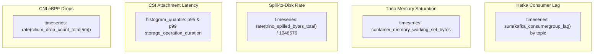

# Golden Signals as Code

Platform telemetry is codified in Kubernetes `PrometheusRule` manifests and Grafana dashboard models.

---

## Prometheus Golden Signals Matrix

| Alert Name | Substrate | Threshold Expression | Duration | Severity | Actionable Runbook URL |
|:---|:---|:---|:---|:---|:---|
| `LakehouseKafkaConsumerLagCritical` | Kafka Ingest | `sum(kafka_consumergroup_lag) > 50000` | 5m | **Critical** | `RB-LAKEHOUSE-001` |
| `TrinoCoordinatorMemorySaturation` | Trino Query | `memory_working_set / memory_limit > 0.88` | 3m | **Critical** | `INC-2026-0822-02` |
| `TrinoQuerySpillPressureHigh` | Trino Storage | `rate(trino_spilled_bytes_total[5m]) > 500MB/s`| 5m | **Warning** | `ADR-0001` |
| `CSIVolumeAttachTimeoutExceeded` | CSI Storage | `rate(storage_op_failures[5m]) > 0.05` | 5m | **Critical** | `INC-2026-0814-01` |
| `CNIPacketDropRatioHigh` | Cilium CNI | `rate(cilium_drop) / rate(cilium_fwd) > 0.02` | 5m | **Warning** | `INC-2026-0901-03` |
| `KubeLeaseRenewalStalled` | Control Plane | `time() - lease_renew_time > 30s` | 2m | **Critical** | `INC-2026-0908-04` |

---

## Operational Cockpit Dashboard Model

